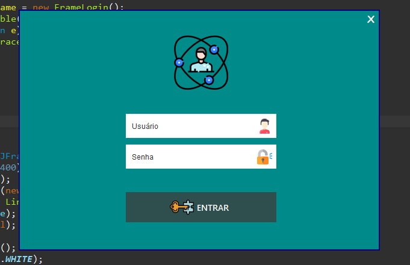
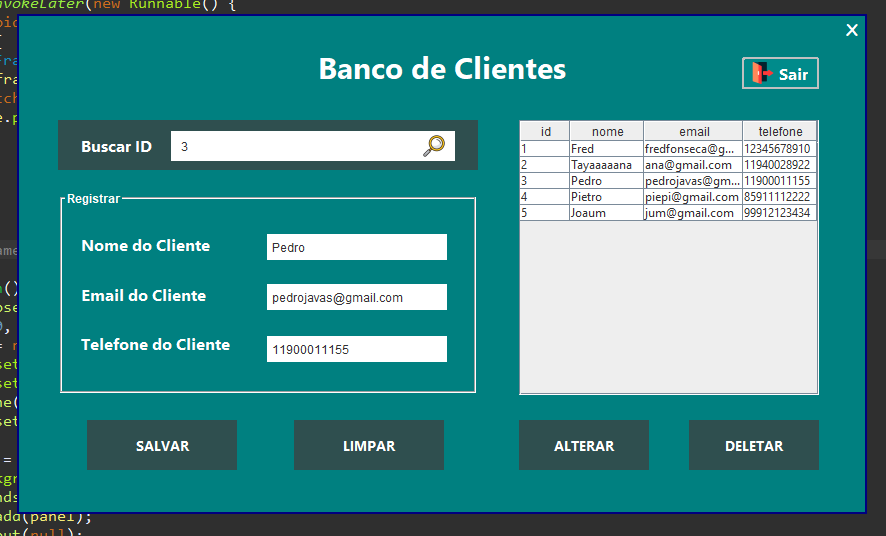

# Login Java - CRUD

<p align="center">
  <a href="#-sobre-o-projeto">Projeto</a>&nbsp;&nbsp;&nbsp;|&nbsp;&nbsp;&nbsp;
  <a href="#-tecnologias-utilizadas">Tecnologias</a>&nbsp;&nbsp;&nbsp;|&nbsp;&nbsp;&nbsp;
  <a href="#-instalação">Instalação</a>&nbsp;&nbsp;&nbsp;|&nbsp;&nbsp;&nbsp;
  <a href="#-license">Licença</a>
</p>

<p align="center">
 

  
</p>

<div align="center">
  
</div>

## :white_check_mark: Resultado

<div align="center">
  
</div>

## 💻 Sobre o projeto

Este projeto trata-se de um CRUD de clientes

## 🚀 Tecnologias utilizadas

Esse projeto foi desenvolvido com as seguintes tecnologias:
- Java
- Window Builder(Java)
- MySQL
 
## 💾 Instalação

Siga os passos a baixo para executar o projeto!

1. Executar o projeto - Opção 01

- execute o arquivo javaproject.jar pelo terminal

```
java -jar javaproject.jar
```

2. Executar o projeto - Opção 02

- Importe o arquivo *login_project* em seu Eclipse e xecute o projeto

2.5 Gerando as tabelas do banco de dados

- Contrua seu banco de dados e tabelas MySQL em localhost (recomendado utilizar o XAMPP para rodar o server)
- Imagem da tabela disponível na pasta [.github](.github)

Dê start na aplicação

## 📬 Como contribuir

- Faça um fork desse repositório;
- Cria uma branch com a sua feature: `git checkout -b minha-feature`;
- Faça commit das suas alterações: `git commit -m 'feat: Minha nova feature'`;
- Faça push para a sua branch: `git push origin minha-feature`.
- Status do Projeto: Concluido :heavy_check_mark:


Depois que o merge da sua pull request for feito, você pode deletar a sua branch.


## 📝 License

Esse projeto está sob a licença MIT. Veja o arquivo [LICENSE](LICENSE) para mais detalhes.

---
<h4 align="center">
    Feito com 💙 ✨ by <a href="https://github.com/freddcf" target="_blank">Fred Fonseca</a>
</h4>
